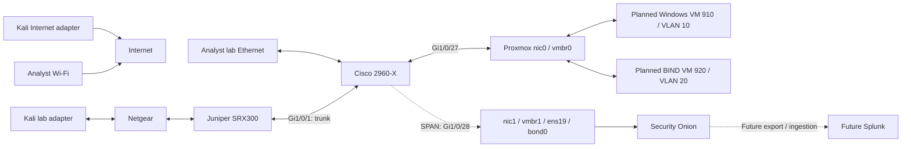

# Splunk detection engineering lab architecture

Status: proposed network configuration, prepared 2026-09-02. Device deployment has not been performed.

## Confirmed current state

- Security Onion VM 900 is the only existing VM.
- No antiX VM is deployed.
- Splunk is not installed.
- The analyst workstation uses Wi-Fi for Internet and Ethernet for the lab.
- Kali uses a separate adapter for Internet and its lab adapter for the ATTACKER network.
- The Fios router is unplugged. It is reserved for later wireless attack experiments and is outside this configuration.
- Baseline device addresses and port assignments below come from the saved configurations; compare them with the live devices before applying changes.

The objective is to generate controlled activity, retain useful evidence, and engineer and validate detection rules in Splunk. Internet access on the analyst and Kali is intentional. The lab does not require an SRX WAN interface or NAT for those hosts.

## Address and port plan

| Role | Network | Address | Status |
|---|---|---|---|
| Kali | ATTACKER, physical SRX ge-0/0/5.0 | 192.168.66.50/24; gateway 192.168.66.1 | Existing host |
| SRX management | VLAN 99, ge-0/0/0.99 | 172.16.99.1/24 | Saved baseline |
| Cisco management | VLAN 99 | 172.16.99.2/24 | Saved baseline |
| Analyst | VLAN 99, Cisco Gi1/0/47 | 172.16.99.10/24; no lab default gateway | Existing host |
| Proxmox | Native VLAN 99, vmbr0 | 172.16.99.20/24 | Saved baseline |
| Security Onion VM 900 | Native VLAN 99, net0/ens18 | 172.16.99.30/24 | Existing VM |
| Splunk plus syslog receiver | VLAN 99 | Proposed 172.16.99.40/24 | Reserved only; not installed |
| Windows victim VM 910 | VLAN 10 | 172.16.10.50/24; gateway 172.16.10.1 | To build |
| Ubuntu/BIND VM 920 | VLAN 20 | 172.16.20.53/24; gateway 172.16.20.1 | To build |
| DNS gateway | VLAN 20, ge-0/0/0.20 | 172.16.20.1/24 | New SRX interface |

Confirm that .40 is unused before assigning it. It is a suggested location for a future Linux Splunk/syslog host, not a dependency for the core network overlay. Do not put Splunk inside the Security Onion appliance.

| Cisco port | Connection | VLAN handling |
|---|---|---|
| Gi1/0/1 | SRX ge-0/0/0 | Tagged 10,20,99; native/parking 999 |
| Gi1/0/27 | Proxmox nic0 / vmbr0 | Tagged 10,20; native 99 |
| Gi1/0/28 | Proxmox nic1 / vmbr1 | SPAN destination; preserve original encapsulation |
| Gi1/0/47 | Analyst Ethernet | Access VLAN 99 |
| Gi1/0/2 | Unused | Remains shut down in VLAN 999 |

The differing native VLANs on the two Cisco trunks are intentional: they serve different connected devices. Do not change the Proxmox native VLAN or tag Security Onion net0 during this extension.

## Forwarding and observation

Windows-to-BIND DNS leaves Proxmox in VLAN 10, traverses the Cisco and SRX, and returns to Proxmox in VLAN 20. The reply traverses the reverse path. Keep routing on the SRX; neither the Cisco nor Proxmox needs another layer-3 gateway.

The normal SPAN profile keeps Gi1/0/27 in both directions and includes all carried VLANs. This retains the existing Kali-to-Proxmox health test and broad lab visibility. It also observes pre-routing and post-routing versions of inter-VLAN packets when both VMs share this uplink.

For controlled DNS measurements, the optional Cisco DNS capture profile selects VLAN 10 in both directions. This gives the victim-side request and response without the second observation in VLAN 20. Use it only for that experiment and restore the general profile afterwards. Do not change to RX-only capture: that would omit traffic arriving at victims from outside the host.

SPAN does not guarantee visibility into same-VLAN traffic switched entirely within Proxmox. Traffic dropped before it reaches Gi1/0/27 requires SRX logs. Internet traffic using the hosts' separate adapters and future wireless traffic will need their own capture arrangements.

## Security policy intent

| Initiator | Destination | Allowed new sessions |
|---|---|---|
| Analyst .99.10 | Victim subnet | Any application for administration and exercises |
| Analyst .99.10 | BIND .20.53 | Any application for administration |
| Analyst .99.10 | Kali .66.50 | Any application for administration |
| Kali .66.50 | Victim subnet | Any application for controlled attack generation |
| Kali .66.50 | BIND .20.53 | UDP/TCP 53 for DNS smoke tests |
| Kali .66.50 | Proxmox .99.20 | Existing ICMP health-test exception only |
| Windows .10.50 | BIND .20.53 | UDP/TCP 53 |
| Victim or DNS server | Management | Denied until the optional collector overlay is enabled |
| DNS server | Victims or Kali | No new sessions |
| Victims | Kali | No new sessions; callback experiments need a separate scoped permit |
| Other interzone traffic | Any | Denied and logged by the managed zone-pair rules |

Stateful replies to permitted sessions do not require reverse allow rules. Management traffic within VLAN 99 stays local to that VLAN, so protect those services with device/host controls. The Cisco SSH ACL admits only the analyst; SRX SSH and ping are available from the management zone using existing authentication.

## Telemetry design

- Zeek DNS records and PCAP supply query names, response codes and network evidence.
- Sysmon and Windows logs will supply process/user context once VM 910 is built.
- BIND query logs will provide server-side observations.
- SRX logs describe permitted/denied sessions, policy names and endpoints. Session counts are not DNS query counts.
- Cisco syslog supplies interface, configuration and switch events; SPAN supplies the actual packet copies.
- Splunk will correlate those sources after a collector and ingestion are deployed.

The core SRX overlay writes bounded local RT_FLOW logs in event mode for low-rate lab validation. The future telemetry files route switch/firewall logs to a proposed collector and allow endpoint forwarders to TCP 9997. An enabled firewall port alone does not establish ingestion.

Use UTC, verify clock offsets before a run, and choose a common time source before comparing timestamps across datasets. NTP service configuration is deferred until an actual server exists.

## Implementation

Start with [the network runbook](02_network_changes.md). Exact device changes are in [Cisco](configs/cisco/dns-lab-changes.txt) and [Juniper](configs/juniper/dns-lab-changes.txt). The required Proxmox VLAN extension is in [the bridge change notes](configs/proxmox/dns-lab-changes.txt).

The historical baseline is retained for reference; the current-state corrections in this document supersede its claims about antiX, installed Splunk, Internet isolation and the Fios connection.
