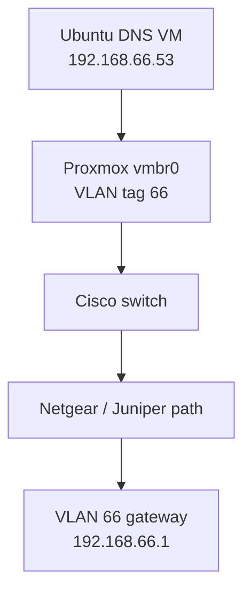

# 02. Network Changes

## Purpose

This document records the network changes and troubleshooting completed for the DNS Exfiltration Detection Lab.

The goal was to make VLAN 66 available to the dedicated Ubuntu BIND9 DNS server while preserving the existing VLAN 10 and VLAN 99 connections.

All changes described here apply only to the lab. The known-good files in `BASELINE_CONFIGURATION/` were not modified.

---

## Network Summary

| VLAN | Subnet            | Purpose                     | Gateway        |
| ---: | ----------------- | --------------------------- | -------------- |
|   10 | `172.16.10.0/24`  | Windows victim network      | `172.16.10.1`  |
|   66 | `192.168.66.0/24` | Kali and DNS-server network | `192.168.66.1` |
|   99 | `172.16.99.0/24`  | Management network          | `172.16.99.1`  |

## Important Systems

| System              | IP address      | Network role                       |
| ------------------- | --------------- | ---------------------------------- |
| Proxmox             | `172.16.99.20`  | Hosts the lab virtual machines     |
| Ubuntu DNS server   | `192.168.66.53` | Runs BIND9 on VLAN 66              |
| Kali Linux          | `192.168.66.50` | Generates controlled lab traffic   |
| Windows 11 victim   | `172.16.10.50`  | Sends DNS requests during testing  |
| Security Onion      | `172.16.99.30`  | Monitors copied network traffic    |
| Analyst workstation | `172.16.99.10`  | Used for management and validation |

---

## Network Path

The DNS server is a virtual machine running on Proxmox. Its traffic follows this path:



The Proxmox virtual bridge, Cisco trunk, physical cable, downstream switching, and Juniper interface must all carry VLAN 66. A failure at any point can prevent the DNS server from reaching its gateway.

---

# Proxmox Change - Add VLAN 66

## Why Was This Needed?

The Ubuntu DNS server uses VLAN 66.

Proxmox connects its virtual machines to a Linux bridge named `vmbr0`. Because this bridge is VLAN-aware, it has a list of VLANs that it is allowed to carry.

Before this change, the bridge permitted only VLANs 10 and 99:

```text
bridge-vids 10 99
```

A virtual machine connected to VLAN 66 would not have working network connectivity until VLAN 66 was added to this list.

---

## Configuration Change

The following line in the Proxmox network configuration:

```text
bridge-vids 10 99
```

was changed to:

```text
bridge-vids 10 66 99
```

The final `vmbr0` VLAN settings are:

```text
bridge-vlan-aware yes
bridge-vids 10 66 99
```

### Explanation of Settings 

* `bridge-vlan-aware yes` tells Proxmox that `vmbr0` understands VLAN tags.
* `bridge-vids` lists the VLAN IDs that the bridge is permitted to carry.
* `10` is the Windows victim VLAN.
* `66` is the Kali and DNS-server VLAN.
* `99` is the management VLAN.

Adding VLAN 66 did not remove or replace the existing VLANs.

---

## Validate the Configuration Before Applying It

The following command checked the network configuration for errors:

```bash
ifreload -a -n
```

### Command Explanation

* `ifreload` is part of the `ifupdown2` network-management package used by Proxmox.
* `-a` means check all configured network interfaces.
* `-n` performs a dry run.
* A dry run shows what would happen without applying the changes.

This safety check reduces the risk of applying a configuration error that could interrupt Proxmox management access.

### Expected Result

The command should complete without reporting a syntax or configuration error.

If an error appears, do not run the live reload command until the error is corrected.

---

## Apply the Configuration

After the dry run completed successfully, the following command applied the network settings:

```bash
ifreload -a
```

### Command Explanation

* `ifreload` reloads the network-interface configuration.
* `-a` applies the configuration to all managed interfaces.
* Unlike the earlier command, this command does not include `-n`, so it makes the changes active.

Network changes on a remote Proxmox server must be applied carefully because an incorrect bridge or management setting could interrupt access to the server.

---

## Verify the Permitted VLANs

The following command displayed the active VLAN configuration:

```bash
bridge -c vlan show
```

### Command Explanation

* `bridge` displays and manages Linux bridge information.
* `-c` enables color output when the terminal supports it.
* `vlan show` displays the VLANs permitted on each bridge port.

### Verified Result

The output confirmed that the Proxmox bridge and its physical interface permit:

* VLAN 10 for the Windows victim.
* VLAN 66 for the Ubuntu DNS server and Kali.
* VLAN 99 for management.

---

## Verify Management Connectivity

The following command tested Proxmox connectivity to the VLAN 99 gateway:

```bash
ping -c 4 172.16.99.1
```

### Command Explanation

* `ping` sends ICMP echo-request packets to another system.
* `-c 4` tells Linux to send four packets and then stop.
* `172.16.99.1` is the management-network gateway.

### Why This Test is Important

The Proxmox management connection uses VLAN 99. Testing the gateway after the bridge change confirms that adding VLAN 66 did not break the existing management network.

### Verified Result

The gateway replied successfully with `0%` packet loss.

---

# Ubuntu DNS Server Network Configuration

## Server Settings

The Ubuntu DNS server was configured with the following values:

| Setting                 | Value               |
| ----------------------- | ------------------- |
| Hostname                | `dns-srv-01`        |
| IP address              | `192.168.66.53/24`  |
| Gateway                 | `192.168.66.1`      |
| Proxmox bridge          | `vmbr0`             |
| Proxmox VLAN tag        | `66`                |
| Virtual NIC MAC address | `BC:24:11:EA:70:0A` |

The VLAN tag is applied by the Proxmox virtual-network interface. Ubuntu therefore uses a normal network interface and does not need to create its own VLAN sub-interface.

---

## Display the Server Addresses

The following command can be used on Ubuntu to display its network interfaces and addresses:

```bash
ip -br address
```

### Command Explanation

* `ip` is the standard Linux network-management command.
* `-br` means brief output.
* `address` displays the IP addresses assigned to the interfaces.

### Expected Result

The active network interface should show:

```text
192.168.66.53/24
```

The `/24` prefix means the subnet mask is `255.255.255.0`.

---

## Display the Routing Table

The following command displays the server's network routes:

```bash
ip route
```

### Command Explanation

* `ip` is the Linux networking command.
* `route` displays the routing table.
* The routing table tells the server where to send packets for local and remote networks.

### Expected Result

The output should include a default route through the VLAN 66 gateway:

```text
default via 192.168.66.1
```

It should also include a connected route for the local subnet:

```text
192.168.66.0/24
```

---

# Initial Connectivity Problem

## Symptom

After VLAN 66 was added to Proxmox and the DNS server was configured, the DNS server initially could not ping its gateway:

```bash
ping -c 4 192.168.66.1
```

The gateway did not reply.

This meant the DNS server did not yet have complete Layer 2 or Layer 3 connectivity to the Juniper VLAN 66 interface.

---

## Gateway Ping Tests

A successful gateway ping confirms several parts of the network path:

1. The Ubuntu interface is active.
2. The virtual machine is connected to the correct Proxmox bridge.
3. The VLAN tag is correct.
4. Proxmox permits VLAN 66.
5. The Cisco switch carries VLAN 66.
6. The physical network path is connected.
7. The Juniper VLAN 66 interface is active and reachable.
8. No policy or firewall rule is blocking the required traffic.

A failed ping does not identify which component is broken. The path must be checked one section at a time.

---

# Juniper Checks

## Verify the VLAN 66 Interface

The Juniper interface for VLAN 66 was identified as:

```text
ge-0/0/5.0
```

Its configured IP address is:

```text
192.168.66.1/24
```

This address is the default gateway for the Ubuntu DNS server and other systems on VLAN 66.

A useful Juniper command for checking the interface is:

```text
show interfaces terse ge-0/0/5.0
```

### Command Explanation

* `show interfaces terse` displays a short interface-status summary.
* `ge-0/0/5.0` identifies the exact logical interface being checked.
* The interface should be both administratively and operationally active.

An interface can be configured correctly but still fail if the physical path leading to it is disconnected.

---

## Check the ARP Table

The Juniper ARP table was checked for the DNS server:

```text
show arp no-resolve | match 192.168.66.53
```

### Command Explanation

* `show arp` displays the Address Resolution Protocol table.
* ARP maps an IPv4 address to a MAC address on the local network.
* `no-resolve` prevents the device from trying to convert IP addresses into hostnames.
* `match 192.168.66.53` limits the output to the DNS server.

### Observed Result

The Juniper device did not initially have an ARP entry for `192.168.66.53`.

### What This Means

The missing ARP entry showed that the Juniper gateway had not successfully learned the DNS server's MAC address.

This suggested a Layer 2 path problem, such as:

* An incorrect VLAN.
* A disconnected/broken cable.
* A disabled switch port.
* VLAN 66 missing from a trunk.
* The virtual machine connected to the wrong bridge or VLAN tag.

---

## Review the Security Policy

An existing security policy named `WIN-TO-KALI` was found between the management and attacker-side zones.

The policy currently permits broad traffic using settings equivalent to:

```text
source-address any
destination-address any
application any
action permit
```

### Explanation

A security policy determines which traffic may pass from one Juniper security zone to another.

* `source-address any` accepts traffic from any source covered by the policy.
* `destination-address any` accepts traffic to any destination covered by the policy.
* `application any` accepts any recognized protocol or port.
* `permit` allows matching traffic to pass.

### Security Note

This broad rule helped rule out the firewall policy as the immediate cause of the connectivity problem. However, an `any/any/any` rule gives more access than this lab requires.

A later hardening step should replace or narrow it with rules that permit only the required traffic, such as:

* DNS over UDP port 53.
* DNS over TCP port 53.
* SSH over TCP port 22 from the management network.
* ICMP only when needed for troubleshooting.

The policy should not be narrowed until all required lab traffic paths are fully understood and documented.

---

# Cisco Switch Checks

## Verify the Proxmox Trunk

The Proxmox host connects to Cisco interface:

```text
GigabitEthernet1/0/27
```

The trunk was checked to confirm that VLAN 66 was permitted.

A useful Cisco command is:

```text
show interfaces trunk
```

### Command Explanation

* `show interfaces trunk` lists switch ports operating as VLAN trunks.
* It also shows which VLANs are allowed and active on each trunk.
* A trunk can carry traffic for multiple VLANs over one physical cable.

### Verified Result

The Proxmox trunk was operating and carrying the required lab VLANs, including VLAN 66.

---

## Verify That the Switch Learned the DNS Server

The Cisco MAC-address table was checked for the DNS-server virtual NIC:

```text
show mac address-table address bc24.11ea.700a
```

### Command Explanation

* `show mac address-table` displays MAC addresses learned by the switch.
* `address bc24.11ea.700a` limits the output to the DNS server's virtual NIC.
* Cisco displays MAC addresses using groups of four hexadecimal characters.

The Proxmox MAC address:

```text
BC:24:11:EA:70:0A
```

appears in Cisco format as:

```text
bc24.11ea.700a
```

### Verified Result

The Cisco switch learned the DNS-server MAC address on `GigabitEthernet1/0/27`.

### What This Proved

This result confirmed that:

* The Ubuntu virtual NIC was active.
* The VM was connected to Proxmox `vmbr0`.
* The VLAN 66 tag reached the Cisco switch.
* The Proxmox-to-Cisco trunk was working.

The problem had to be farther downstream.

---

## Check the Downstream Interface

Cisco interface `GigabitEthernet1/0/2` was part of the path toward the downstream Netgear and Juniper network.

The switch reported this interface as:

```text
notconnect
```

### What `notconnect` Means

`notconnect` normally means the switch does not detect a working physical Ethernet link.

Common causes include:

* No cable is connected.
* The cable is connected to the wrong port.
* The far-end device is powered off.
* The far-end port is disabled.
* The cable is damaged.
* A transceiver or adapter is not working.

Because the Proxmox-side MAC address was learned correctly, this downstream physical-link failure became the main suspect.

---

# Root Cause

The VLAN configuration on Proxmox and the Cisco trunk was correct.

The actual problem was a  physical cable between Cisco interface `GigabitEthernet1/0/2` and the downstream Netgear/Juniper network path. was connected to the wrong port. 

As such, VLAN 66 traffic reached the Cisco switch but could not continue to the Juniper gateway at `192.168.66.1`.

This also explained why:

* The Cisco switch learned the DNS server's MAC address on the Proxmox trunk.
* The Juniper device did not learn an ARP entry for the DNS server.
* The DNS server could not ping its gateway.
* Cisco interface `GigabitEthernet1/0/2` showed `notconnect`.

---

# Corrective Action

Switching the cable from `GigabitEthernet1/0/3` to `GigabitEthernet1/0/2`
No additional Proxmox VLAN change was required because VLAN 66 had already been configured correctly.

After the port was was changed, the physical link became active and VLAN 66 traffic could reach the Juniper gateway.

---

# Final Validation

## Test the VLAN 66 Gateway

The following command was run from the Ubuntu DNS server:

```bash
ping -c 4 192.168.66.1
```

### Command Explanation

* `ping` sends ICMP echo requests.
* `-c 4` sends four requests and stops.
* `192.168.66.1` is the VLAN 66 gateway.

### Verified Result

The gateway replied successfully.

This confirmed that the DNS server had working connectivity through Proxmox, the Cisco switch, the downstream network, and the Juniper gateway.

---

## Test SSH from the Management Network

SSH access to the DNS server was tested from the management network:

```powershell
ssh dnsadmin@192.168.66.53
```

### Command Explanation

* `ssh` starts a Secure Shell connection.
* `dnsadmin` is the Ubuntu account.
* `@192.168.66.53` identifies the DNS server.
* SSH uses TCP port 22 by default.

### Verified Result

A new SSH connection from the management network succeeded.

This confirmed that the required management path and Ubuntu firewall rule were working.

---

## Test the SSH Port Without Logging In

PowerShell can also test whether TCP port 22 is reachable:

```powershell
Test-NetConnection -ComputerName 192.168.66.53 -Port 22
```

### Command Explanation

* `Test-NetConnection` tests network connectivity from Windows.
* `-ComputerName 192.168.66.53` identifies the DNS server.
* `-Port 22` tests the SSH service port.

A successful test displays:

```text
TcpTestSucceeded : True
```

This tests the network port but does not authenticate to the Ubuntu server.

---

## Test DNS from the Management Network

The following PowerShell command sent a DNS query directly to the BIND9 server:

```powershell
Resolve-DnsName -Name normal.exfil.test -Server 192.168.66.53 -Type A
```

### Command Explanation

* `Resolve-DnsName` is the Windows PowerShell DNS lookup command.
* `-Name normal.exfil.test` identifies the test hostname.
* `-Server 192.168.66.53` sends the request directly to the lab BIND9 server.
* `-Type A` requests an IPv4 address record.

### Verified Result

The server returned:

```text
Name       : normal.exfil.test
Type       : A
TTL        : 300
IPAddress  : 192.168.66.53
```

This confirmed that:

* The analyst workstation could reach VLAN 66.
* UDP or TCP port 53 was permitted as required.
* BIND9 received the request.
* The `exfil.test` zone was loaded.
* The server returned the expected IPv4 address.

The BIND9 query log recorded the source of this request as `172.16.99.10`, which is the analyst workstation on the management network.


# Troubleshooting Lessons

## Check One Network Layer at a Time

A useful troubleshooting order is:

1. Confirm that the virtual machine has the correct IP address.
2. Confirm that it has the correct default gateway.
3. Confirm that the Proxmox virtual NIC uses the correct bridge and VLAN tag.
4. Confirm that the Proxmox bridge permits the VLAN.
5. Confirm that the upstream switch trunk permits the VLAN.
6. Check whether the switch learns the virtual machine's MAC address.
7. Check the status of every physical port in the path.
8. Check whether the gateway learns an ARP entry.
9. Review firewall policies only after the basic physical and VLAN path is confirmed.
10. Test the actual application, such as SSH or DNS.

This order helps avoid changing a firewall or service configuration when the real problem is a port cable mismatch.

---

## MAC Learning and ARP Are Different

A Cisco MAC-address-table entry proves that the switch has seen Ethernet frames from a device.

A Juniper ARP entry proves that the gateway has associated an IPv4 address with a MAC address.

In this incident:

* Cisco learned the DNS server's MAC address.
* Juniper did not initially learn the DNS server's ARP entry.

That difference showed that traffic reached the Cisco switch but did not complete the path to the Juniper gateway.

---

## Physical Connections Still Matter in Virtual Labs

The DNS server was virtual, but its traffic still depended on physical switches, cables, and firewall interfaces.

A correct virtual-machine configuration cannot compensate for a missing physical cable.

Always check link lights and interface states when a correctly configured VLAN still has no connectivity.

---

# Security Follow-Up

The existing broad Juniper policy should be reviewed after the lab traffic requirements are finalized.

A more restrictive policy should allow only the traffic the lab requires.

| Source               | Destination       | Protocol or port | Purpose                       |
| -------------------- | ----------------- | ---------------- | ----------------------------- |
| Management VLAN      | DNS server        | TCP 22           | SSH administration            |
| Victim VLAN          | DNS server        | UDP/TCP 53       | DNS queries                   |
| VLAN 66              | DNS server        | UDP/TCP 53       | Kali and local DNS testing    |
| Management VLAN      | DNS server        | UDP/TCP 53       | Administrative DNS validation |
| Approved lab systems | Approved gateways | ICMP             | Limited troubleshooting       |

Any policy change must be tested carefully to make sure DNS responses and established connections are still permitted.

---

# Rollback Information

If VLAN 66 must be removed from the Proxmox bridge, change:

```text
bridge-vids 10 66 99
```

back to:

```text
bridge-vids 10 99
```

Before applying the rollback, validate the configuration:

```bash
ifreload -a -n
```

If the validation succeeds, apply it:

```bash
ifreload -a
```

Then confirm that management connectivity still works:

```bash
ping -c 4 172.16.99.1
```

Removing VLAN 66 will disconnect the Ubuntu DNS server and any other VLAN 66 virtual machines connected through this bridge.

Do not perform this rollback while the DNS lab is active unless the disconnection is intentional.

---

# Final Result

VLAN 66 is now available on the Proxmox `vmbr0` bridge.

The Ubuntu DNS server at `192.168.66.53` can reach its gateway at `192.168.66.1`. Management SSH access and remote DNS queries also work.

The initial connectivity failure was caused by a missing physical cable in the downstream Cisco-to-Netgear/Juniper path, not by the Proxmox VLAN configuration or the BIND9 service.
