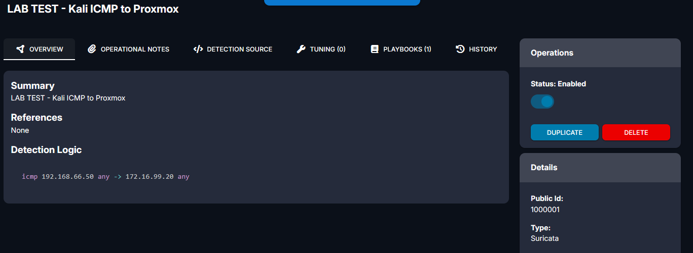
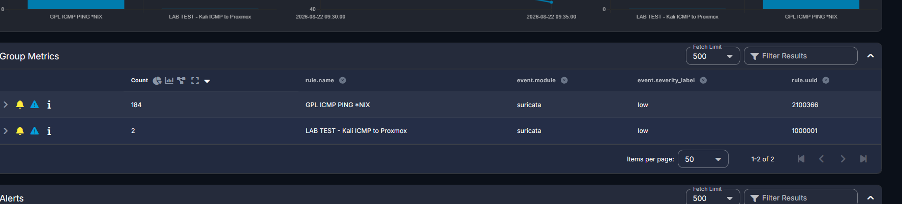
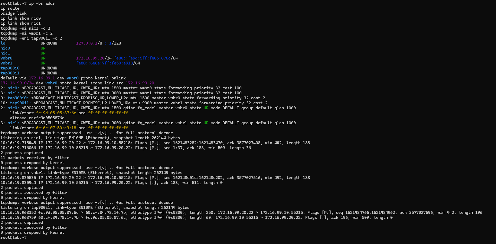

# 04 — Detections and Telemetry

This section provides visual proof that the Security Onion detection pipeline is working.

---

## 1. Custom Suricata Rule



**Description:**  
Custom Suricata rule **SID 1000001** detects ICMP traffic from Kali `192.168.66.50` to Proxmox `172.16.99.20`.

```text
LAB TEST - Kali ICMP to Proxmox
```

---

## 2. Working Security Onion Alerts



**Description:**  
Security Onion SOC confirms that the custom rule is generating alerts.

The screenshot shows:

- `LAB TEST - Kali ICMP to Proxmox`
- Suricata
- SID `1000001`
- Successful alert count
- Built-in `GPL ICMP PING *NIX` detection

This confirms that Suricata is receiving, decoding, and alerting on the mirrored traffic.

---

## 3. Proxmox SPAN Traffic Validation



**Description:**  
Packet captures confirm mirrored traffic successfully travels through the Proxmox monitoring path:

```text
Cisco Gi1/0/28
      ↓
nic1
      ↓
vmbr1
      ↓
tap900i1
      ↓
Security Onion ens19
      ↓
bond0
      ↓
Suricata
```

The capture path uses **MTU 9000**.

---

## Final Result

```text
Cisco SPAN
    ↓
Proxmox
    ↓
Security Onion
    ↓
Suricata
    ↓
SOC Alert ✅
```
